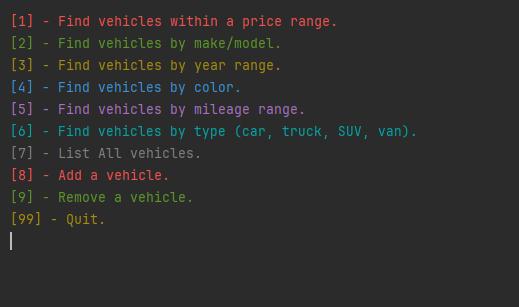
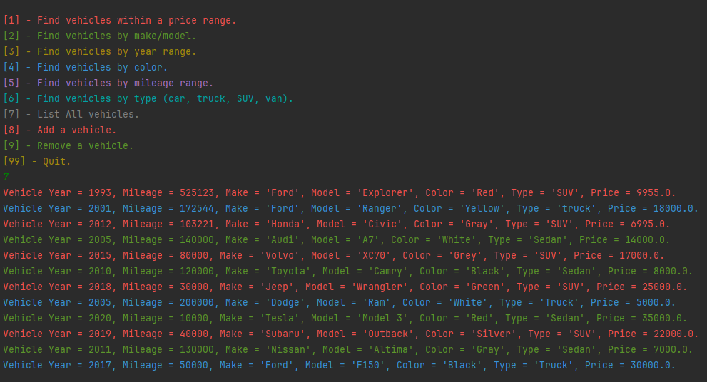
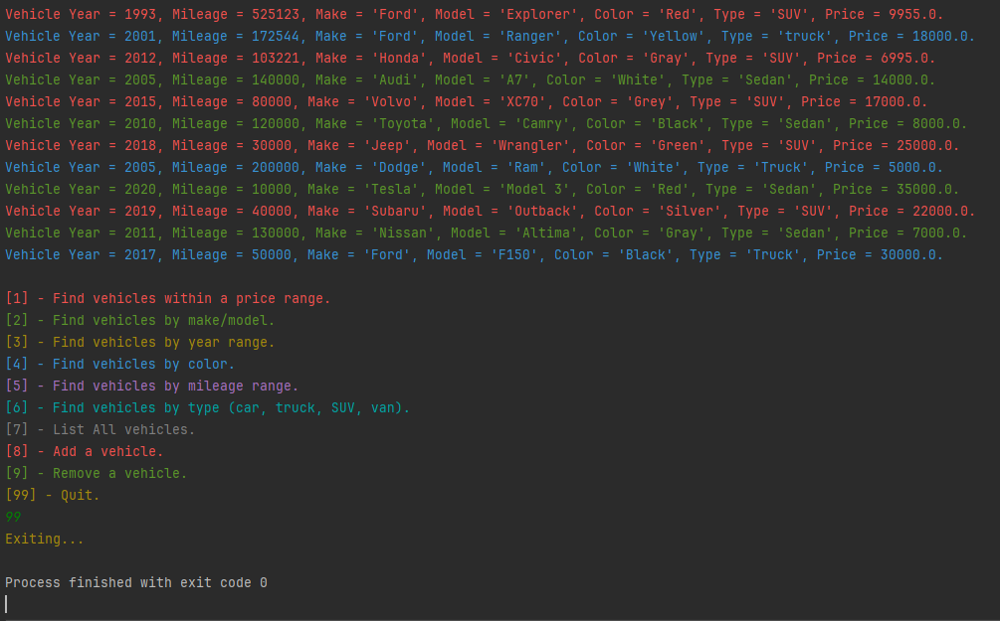

# 🚀 Car_Dealer_Ship

## Car Dealership Management System

This is a Car Dealership Management System developed in Java. The system allows you to manage a vehicle inventory by providing options to add, remove, and search vehicles based on various parameters.🔥

## Features

- Find vehicles within a price range: This feature allows you to search for vehicles within a specified price range. You just need to enter the minimum and maximum price, and the system will list all the vehicles within that price range.

- Find vehicles by make/model: This feature allows you to search for vehicles by their make and model. You just need to enter the make and model of the vehicle, and the system will list all the vehicles that match your input.

- Find vehicles by year range: This feature allows you to search for vehicles by their manufacturing year. You just need to enter the year, and the system will list all the vehicles manufactured in that year.

- Find vehicles by color: This feature allows you to search for vehicles by their color. You just need to enter the color, and the system will list all the vehicles of that color.

- Find vehicles by mileage range: This feature allows you to search for vehicles by their mileage. You just need to enter the mileage, and the system will list all the vehicles that have run that mileage.

- Find vehicles by type (car, truck, SUV, van): This feature allows you to search for vehicles by their type. You just need to enter the type of the vehicle (car, truck, SUV, van), and the system will list all the vehicles of that type.

- List ALL vehicles: This feature lists all the vehicles in the inventory.

- Add a vehicle: This feature allows you to add a new vehicle to the inventory. You need to enter the details of the vehicle like id, year, make, model, type, color, mileage, and price.

- Remove a vehicle: This feature allows you to remove a vehicle from the inventory. You just need to enter the id of the vehicle, and the system will remove that vehicle from the inventory.

The system runs until you choose to quit by entering 99. All changes made to the inventory are saved to the "Files/inventory.csv" file.

## How to Run

- The main class runs the application and starts the UserInterface class. The UserInterface class is structured to use a switch statement to handle the user's choices. The system will continue to run until the user enters 99, at which point it will save any changes made to the inventory and exit.

Here is an example of running process.

And here is exiting process of program.

